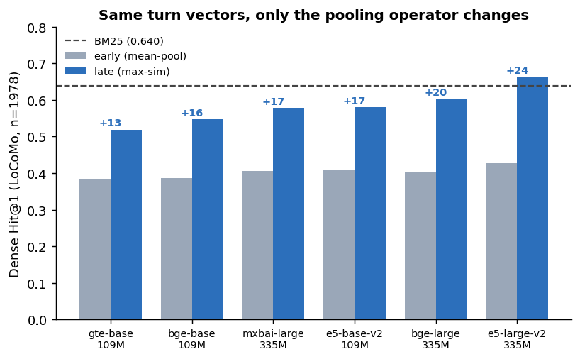
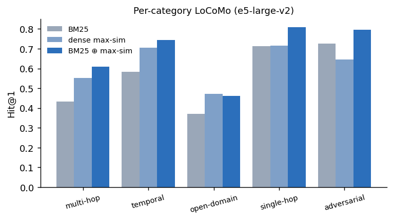

# Training-Free Lexical–Dense Fusion for Conversational-Memory Retrieval

Reproduction code and paper for *Training-Free Lexical–Dense Fusion for
Conversational-Memory Retrieval* (Christian Lysenstøen, 2026).

**TL;DR.** On the LoCoMo benchmark, fusing **BM25** with **turn-level
late-interaction** dense retrieval (max-similarity over per-turn vectors) at
the score level — with a single leave-one-conversation-out weight — beats
either component, needs **no training**, and runs on **CPU**. Adding a
cross-encoder reranker on top *hurts*. We credit the turn-level
late-interaction retriever to **Nano-Memory** (Wu et al., 2026); the
contribution here is a controlled study of the lexical–dense fusion recipe
*around* it.

## Headline result

LoCoMo, Hit@1, honest leave-one-conversation-out cross-validation (e5-large-v2):

| Method | Hit@1 |
|---|---|
| BM25 | 0.640 |
| Dense, mean-pool session (early interaction) | 0.427 |
| Dense, max-sim turn (late interaction) | 0.664 |
| **BM25 ⊕ max-sim turn (fusion)** | **0.752** |

- Fusion adds **+8.8 to +17.2 pp Hit@1 over late interaction alone** across six
  encoders (all *p* < 1e-4).
- An off-the-shelf web-search cross-encoder reranker on the fused list
  **degrades** Hit@1 by 6.9 pp.
- Honest boundary: on **LongMemEval-S** — a lexical regime where BM25
  saturates — the net fusion gain over BM25 is small and not significant.



*Holding the retrieval unit fixed at session and reusing identical cached turn
vectors, switching the pooling operator from early (mean-pool) to late
(max-sim) lifts dense Hit@1 above the BM25 reference at every encoder.*



*A division of labor: dense late interaction wins on multi-hop and temporal
questions, trails BM25 on adversarial ones, and fusion combines whichever
signal a query needs.*

Full paper: [`paper/paper.pdf`](paper/paper.pdf). arXiv: *link to be added.*

## Repository structure

```
paper/            LaTeX source, BibTeX, .bbl, figures, and the compiled PDF
results/          result receipts (JSON + Markdown) and figures for every table
data/locomo/      where to place the LoCoMo benchmark (see its README)
*.py              reproduction scripts (see "Reproduction" below)
requirements.txt
```

## Reproduction

```bash
pip install -r requirements.txt
# 1. Get LoCoMo  ->  see data/locomo/README.md
# 2. Build cached turn/query embeddings (first run only):
python embed_locomo.py && python embed_turns.py
# 3. Run the experiments (CPU, from cache):
python tune13_interaction.py        # late vs early + fusion        (Tables 1,2,4,5,7)
python tune13b_fusion_vs_late.py    # fusion vs late-alone          (Table 3)
python tune10_rerank.py             # cross-encoder reranking       (Table 6)
python analysis_deep.py             # per-category, length, alpha   (Tables 9,10; Figs 2,3)
python lme_interaction.py --model intfloat/e5-base-v2 \
       --qpref "query: " --ppref "passage: "   # LongMemEval-S      (Table 8)
python make_figures.py              # Figure 1
```

Every number in the paper has a receipt under `results/<run>/` (`*.json` raw,
`*.md` human-readable). Embedding caches are regenerated by the `embed_*`
scripts and are not checked in.

**Key modules**

| File | Purpose |
|---|---|
| `locomo.py` | LoCoMo loader (LongMemEval-S loads via the HF `datasets` Hub) |
| `embed_locomo.py`, `embed_turns.py`, `embed_turns_multi.py` | build & cache turn / query embeddings |
| `tune7_bm25.py` … `tune13_interaction.py`, `tune13b_fusion_vs_late.py` | LoCoMo experiments (BM25, fusion, ablations); BM25 + metrics are defined inline |
| `tune10_rerank.py` | cross-encoder reranking (the negative result) |
| `lme_interaction.py`, `lme_maxsim.py` | LongMemEval-S |
| `analysis_deep.py`, `latency.py`, `make_figures.py` | analysis + figures |
| `e2e_qa.py` | optional end-to-end QA harness (needs an LLM reader API key) |

## Citation

```bibtex
@misc{lysenstoen2026fusion,
  title  = {Training-Free Lexical--Dense Fusion for Conversational-Memory Retrieval},
  author = {Lysenst{\o}en, Christian},
  year   = {2026},
  note   = {arXiv preprint}
}
```

## License

Code is released under the MIT License (see [`LICENSE`](LICENSE)).
The paper in `paper/` is licensed CC BY 4.0.
